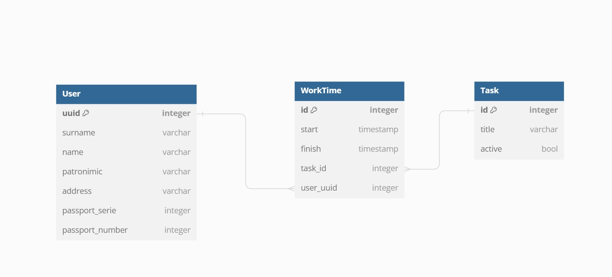

# Задача: Pеализовать тайм-трекер

## Что было необходимо реализовать:

(_отмечено то, что реализовано или частично реализовано_)

1. Выставить REST методы
- [x]  Получение данных пользователей:
- [x] Фильтрация по всем полям.
- [x]   Пагинация.
- [ ]   Получение трудозатрат по пользователю за период задача-сумма часов и минут с сортировкой от большей затраты к меньшей
- [x]   Начать отсчет времени по задаче для пользователя
- [x]   Закончить отсчет времени по задаче для пользователя
- [ ]   Удаление пользователя
- [x]   Изменение данных пользователя
- [x]   Добавление нового пользователя в формате:
```json
{
	"passportNumber": "1234 567890" // серия и номер паспорта пользователя
}
```
- [x] При добавлении сделать запрос в АПИ, описанного сваггером
```yaml
openapi: 3.0.3
info:
  title: People info
  version: 0.0.1
paths:
  /info:
    get:
      parameters:
        - name: passportSerie
          in: query
          required: true
          schema:
            type: integer
        - name: passportNumber
          in: query
          required: true
          schema:
            type: integer
      responses:
        '200':
          description: Ok
          content:
            application/json:
              schema:
                $ref: '#/components/schemas/People'
        '400':
          description: Bad request
        '500':
          description: Internal server error
components:
  schemas:
    People:
      required:
        - surname
        - name
        - address
      type: object
      properties:
        surname:
          type: string
          example: Иванов
        name:
          type: string
          example: Иван
        patronymic:
          type: string
          example: Иванович
        address:
          type: string
          example: г. Москва, ул. Ленина, д. 5, кв. 1
```
- [x] Обогащенную информацию положить в БД postgres
(структура БД должна быть создана путем миграций при старте сервиса) (___настроил миграции при запуске приложения, но также сделал Make-файл на случай, если что-то пойдёт не так___)

- [ ] Покрыть код debug- и info-логами
- [x] Вынести конфигурационные данные в .env-файл
- [x] Сгенерировать сваггер на реализованное АПИ (___реализовано частично___)

Через Make-файл также можно запустить базу данных в Docker